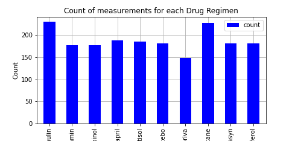
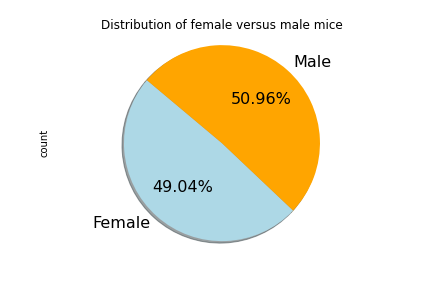
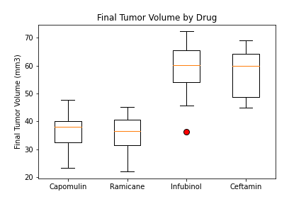
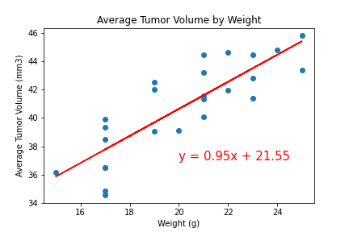

# matplotlib-challenge
Matplotlib challenge for Rutgers Data Science Bootcamp

####Pymaceuticals

###Summary of study results

1. A good number of observations were captured per drug regimen which gives us a sound sample size for analysis.

2. The study had a near equivalent number of male and female mice.

3. Based on average final tumor volume both Capomulin and Ramicane appeared to be equally effective. Of these four drugs (Capomulin, Ramicane, Infubinol, and Ceftamin) only Infubinol had one outlier data point - the rest did not have any outliers. So we can conclude that the results of this analysis is pretty consistent and reliable.

4. Mouse weight correlated (positive) strongly (R-squared of 0.84) with average tumor volume. So we can conclude that, the heavier the mouse, the less effective the drug is (looking at the regression line on the scatter plot).

